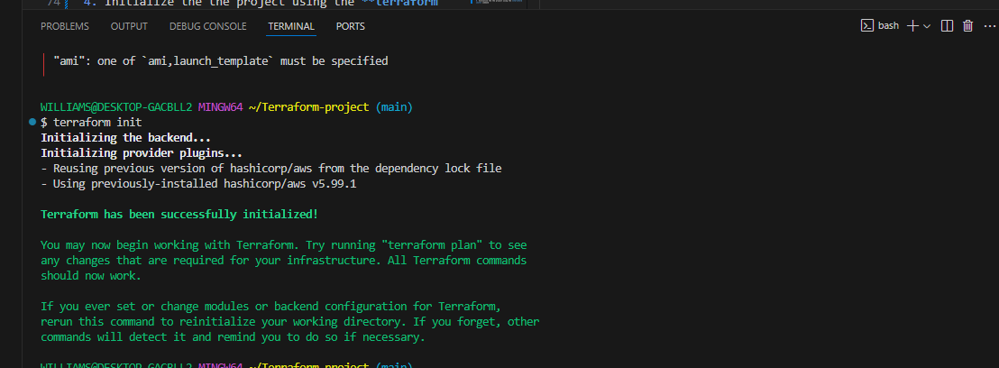
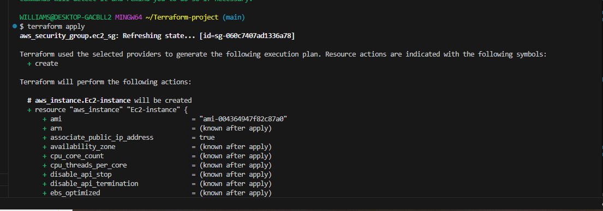
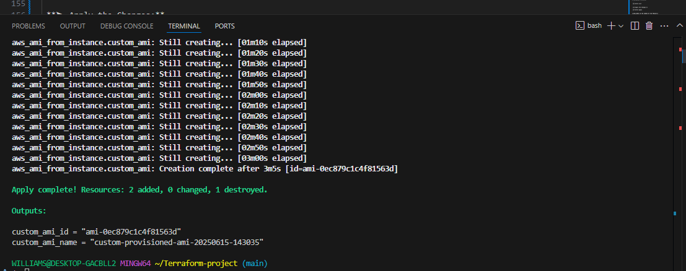

# **TERRAFORM EC2 INSTANCE AND AMI CREATION**
**Purpose :** 
  In this mini project you will use terraform to automate the creation of  EC2 instance on AWS and then create an Amazon Machine Image **(AMI)** from that instance
**Objective:**

1. **Terraform Configuration**
 * Learn how to write basic terraform configuration files.
  
2. **EC2 Instance Creation:**
    
* Use terraform to create EC2 instance on AWS   
3.   **AMI Creation:**
 Automate the creation of an AMI from the  created EC2 instance.

  **Project Tasks:**

  **Task 1: Terraform Configuration for Ec2 Instance**
     
1. Create a directory called  Terraform
  
     ``mkdir Terrform``
2. Inside the directory create a configuration file called main.tf 
 
    ``touch main.tf`` 

3. Write a terraform code to create an EC2 instance ,Specify instance type,keypair,security group etc
    
   ```
   provider "aws" {
   region = "us-east-2"
    }

   resource "aws_instance" "Ec2-instance" {
   key_name = "terraform"
   ami = "ami-004364947f82c87a0"
   instance_type = "t2.micro"

   associate_public_ip_address = true

   tags = {
     Name = "MyEC2"
     }
   }

# Create security group allowing SSH and HTTP
    
    ```
    resource "aws_security_group" "ec2_sg" {
    name        = "terraform-ec2-sg"
    description = "Allow SSH and HTTP access"

    ingress {
    from_port   = 22
    to_port     = 22
    protocol    = "tcp"
    cidr_blocks = ["0.0.0.0/0"]  # Restrict to your IP in production
    }

    ingress {
    from_port   = 80
    to_port     = 80
    protocol    = "tcp"
    cidr_blocks = ["0.0.0.0/0"]
    }

    egress {
    from_port   = 0
    to_port     = 0
    protocol    = "-1"
    cidr_blocks = ["0.0.0.0/0"]
      }
    } 
    ```

4. Initialize the the project using the **terraform init** command


5. Apply the terraform configurationto create the EC2 instance using the command **terraform apply**


**Task2:**   AMI CREATION
1. Extend the Terraform configuration to include the creation of an AMI
   
   * We’re going to provision an EC2 instance and then create an AMI from it.

➤ Code 
   ```
    provider "aws" {
    region = "us-east-2"  # Set your AWS region
}
   ```
2. Create the EC2 instance and use provisioners to run shell commands inside the instance.
  
   ```
   resource "aws_instance" "web" {
    ami           =  "ami-004364947f82c87a0"
    instance_type = "t2.micro"
    key_name      = "TF"         # Replace with your  EC2 key pair name
    }
   ```
  
  ➤ Provisioner Block:
  ```
    provisioner "remote-exec" {
    inline = [
      "sudo yum update -y",
      "sudo yum install -y httpd",
      "sudo systemctl enable httpd",
      "sudo systemctl start httpd"
    ]
    }
  ```
  ➤ Connection Details:
  ```
      connection {
      type        = "ssh"
      user        = "ec2-user"
      private_key = file("~/.ssh/TF.pem")  # Replace with your private key path
      host        = self.public_ip
    }
      tags = {
    Name = "AMI-Builder-Instance"
  }
   ```
 **Step 3: Configure Terraform to Create an AMI**
 
 * After the instance is provisioned, create an AMI from it.
  ```
  resource "aws_ami_from_instance" "web_ami" {
  name               = "web-ami-${timestamp()}"  # Dynamic name with timestamp
  source_instance_id = aws_instance.web.id       # Create AMI from this instance
  depends_on         = [aws_instance.web]        # Wait for EC2 to be ready

  tags = {
    Name = "CustomWebAMI"
  }
}
```

**Explanation:**

* **aws_ami_from_instance:** Creates an AMI from an existing instance.

* **name:** Includes a timestamp to keep it unique.

* **source_instance_id:** References the EC2 instance.


* **depends_on:** Ensures the instance is fully ready before creating the AMI.

**Step 4: Apply Configuration**
➤ Initialize Terraform:
 
 ```
 terraform init
 ```

 **➤ Apply the Changes:**
 ```
 terraform apply
```


**CHALLENGE IN THE COURSE OF THE PROJECT**

 The basic challenge was to create an AMI from the instance.But,i was able to figure it out with some research
 